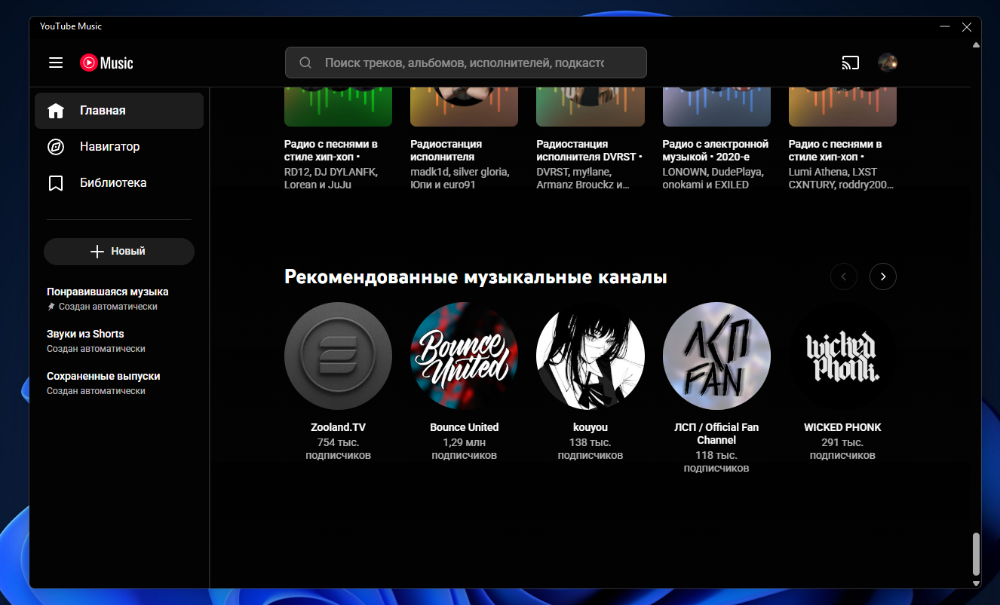

# YouTube Music Desktop

  

**YouTube Music Desktop** — это удобное и легковесное десктопное приложение для прослушивания музыки через сервис YouTube Music. Больше не нужно держать открытой лишнюю вкладку в браузере: управляйте треками, плейлистами и подкастами прямо из отдельного независимого окна с глубокой интеграцией в операционную систему.

---

## 🚀 Установка и запуск

### Стабильная версия (Релизы)
1. Перейдите в раздел **Releases**.
2. Установите и запустите приложение.

### Сборка из исходного кода
Если вы хотите собрать проект самостоятельно, выполните следующие команды в терминале:
dotnet publish -c Release -r win-x64 --self-contained true -p:PublishSingleFile=true
